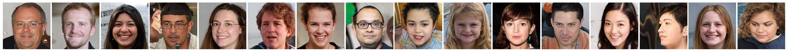
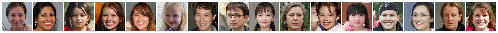
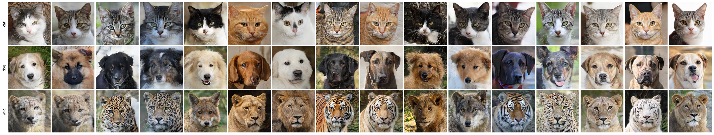
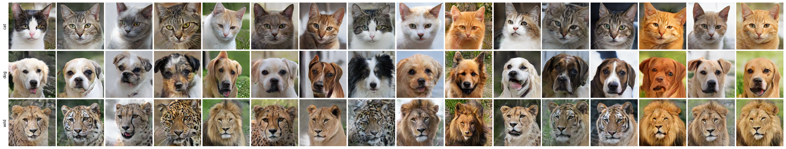
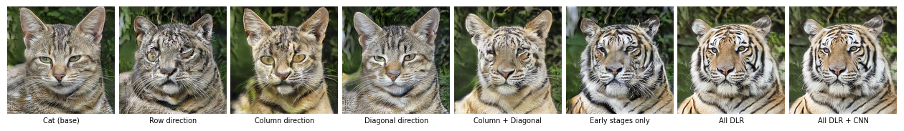

# DSS-GAN

<p align="center">
  
</p>

[Official implementation of DSS-GAN: Directional State Space GAN with Mamba backbone for Class-Conditional Image Synthesis](https://arxiv.org/abs/2603.17637)

We present DSS-GAN, the first generative adversarial network to employ Mamba as a hierarchical generator backbone for noise-to-image synthesis. The central contribution is Directional Latent Routing (DLR), a novel conditioning mechanism that decomposes the latent vector into direction-specific subvectors, each jointly projected with a class embedding to produce a feature-wise affine modulation of the corresponding Mamba scan. Unlike conventional class conditioning that injects a global signal, DLR couples class identity and latent structure along distinct spatial axes of the feature map, applied consistently across all generative scales. DSS-GAN achieves improved FID, KID, and precision-recall scores compared to StyleGAN2-ADA across multiple tested datasets. Analysis of the latent space reveals that directional subvectors exhibit measurable specialization: perturbations along individual components produce structured, direction-correlated changes in the synthesized image. 


- Example weights available on Hugging face 🤗  https://huggingface.co/dssgan/DSS_GAN/tree/main 

## 📓 Notebook Viewer

You can preview the examples in notebook directly in Google Colab:

[](https://colab.research.google.com/github/dssgan/DSS_GAN/blob/main/viewer.ipynb)

---

## ⚠️ Notes on `mamba-ssm`

The `mamba-ssm` dependency does not work reliably out-of-the-box in  due to CUDA and build compatibility issues.

For a stable setup, it is strongly recommended to use the provided **Docker environment** instead of Colab.

---

### Latent space — zbase perturbation

Perturbing the tokenizer latent `zbase` controls global composition and spatial layout while preserving class identity.

<p align="center">
  
  
</p>


---


<p align="center">
  
</p>

*Top: single-class perturbation. Bottom: same perturbation applied simultaneously across all 3 classes — spatial layout changes coherently while class-specific features are preserved.*


---

<p align="center">
  
</p>


*Single-class perturbation*


---


Example FFHQ 256x256 outputs

<p align="center">
  
</p>

<p align="center">
  
</p>
---
Example AFHQ 256x256 outputs

<p align="center">
  
</p>
---

Example AFHQ 512x512 outputs

<p align="center">
  
</p>
---


### Class override

Replacing per-direction class embeddings while keeping `z` fixed produces a gradual semantic transformation. Overriding a single direction produces a partial class shift; replacing all directions completes the conversion.

<p align="center">
  
</p>

*Each column replaces a different subset of per-direction class embeddings with the target class. The row direction carries the least class information; the majority of class-specific structure is modulated at low resolutions (8×8, 16×16).*

---

<details>
<summary><b>Preparing data</b></summary>

Set `DATASET` and `OUT_SIZE` at the top of `src/data/prep_dataset.py`, adjust the corresponding config block, then run:

```bash
python src/data/prep_dataset.py
```

```python
DATASET  = "afhq"   # afhq | afhq512 | ffhq | celeba | lsun
OUT_SIZE = 256
```

Each dataset has a dedicated config block in `src/data/prep_dataset.py`. Adjust the paths before running:

**`afhq` / `afhq512`** — standard multi-class image folder dataset.

| key | description |
|---|---|
| `input_root` | path to raw images, expects `{input_root}/{class}/` subfolders |
| `output_root` | output folder |
| `classes` | list of classes to process — can be a subset of available classes |

**`ffhq`** — single-class dataset. Images are collected recursively from nested subfolders.

| key | description |
|---|---|
| `input_root` | path to raw FFHQ images |
| `output_root` | output folder |
| `class_name` | name of the single output subfolder |

**`celeba`** — attribute-based dataset. A single image can belong to multiple classes simultaneously.

| key | description |
|---|---|
| `input_images` | folder with raw images |
| `attr_file` | path to `list_attr_celeba.txt` |
| `output_root` | output folder |
| `classes` | list of attributes to use as classes — must be valid attribute names from the attr file |
| `max_per_class` | max images per class |
| `crop_size` | center crop size before resizing — CelebA images are 178×218, so 178 crops to square |

**`lsun`** — large-scale scene dataset stored as LMDB. Images are sampled randomly up to `samples_per_class`.

| key | description |
|---|---|
| `input_root` | folder containing `*_train_lmdb` archives |
| `output_root` | output folder |
| `classes` | list of scene categories to process |
| `split` | dataset split, typically `"train"` |
| `crop_size` | center crop size — images smaller than this are skipped |
| `samples_per_class` | max images to extract per class |
| `seed` | random seed for shuffling before sampling |

Output structure (required by the dataloader):
```
AFHQ_resize_256/
  cat/
  dog/
  wild/
```

</details>

---

<details>
<summary><b>Prepare training</b></summary>

**1. Register dataset — `src/dataset.py`**

Make sure `DATASET_CONFIGS` contains an entry pointing to the folder produced by `prep_dataset.py`. The `root` must match `output_root` from `prep_dataset.py`:

```python
DATASET_CONFIGS = {
    "afhq": {"root": "AFHQ_resize_256", "classes": sorted(["cat", "dog", "wild"])},
    # to add a new dataset:
    "my_dataset": {"root": "path/to/folder", "classes": sorted(["class_a", "class_b"])},
}
```

To train on a subset of classes, just list the ones you need:
```python
"afhq": {"root": "AFHQ_resize_256", "classes": sorted(["cat", "wild"])}
```
`NUM_CLASSES` and model embedding sizes update automatically.

To add a custom dataset, also add a config and preprocessing function in `src/data/prep_dataset.py` following the `prep_afhq` pattern, and add a case in `main()`.

**2. Configure training — `src/config.py`**

Set `DATASET` and `IMG_SIZE` to match the preprocessed data:

```python
DATASET  = "afhq"   # must match a key in DATASET_CONFIGS
IMG_SIZE = 256      # must match the resolution produced by prep_dataset.py
```

`CLASSES`, `DATA_ROOT`, and `NUM_CLASSES` are derived automatically — do not set them manually.

Set output directory and batch size:

```python
OUT_DIR    = "AFHQ_256_class_routing_refactor"  # all checkpoints and logs saved here
BATCH_SIZE = 96
```

Set scan directions — controls the geometric diversity of Mamba scanning across resolution blocks:

```python
SCAN_DIRECTIONS = ['row_fwd', 'col_fwd', 'diag_left']
```

Available: `row_fwd`, `row_bwd`, `col_fwd`, `col_bwd`, `diag_left`, `diag_right`. The number of directions affects `Z_DIM` — do not change after starting training.

`LATENT_BASE` and `LATENT_DIR` control the latent space split between the shared token part and the per-direction routing part:

```python
LATENT_BASE = 88   # shared latent token dimension
LATENT_DIR  = 28   # latent dims per scan direction
               # Z_DIM = LATENT_BASE + LATENT_DIR * len(SCAN_DIRECTIONS)
```

R1 regularization:

```python
R1_GAMMA    = 5   # regularization strength
R1_INTERVAL = 4   # apply R1 every N steps
```

For a detailed description of all remaining parameters, refer to the paper.

</details>

---

<details>
<summary><b>Training</b></summary>

```bash
python src/train.py
```

Checkpoints (`G_full_epoch_*.pt`, `G_full_ema_epoch_*.pt`) and sample grids are saved to `OUT_DIR` every `SAVE_EVERY` epochs. Metrics are logged to `gan_metrics_log.json` in the same folder.

</details>


## 📜 License

This repository is licensed under the MIT License.

---

## 📄 Citation

If you find this work useful, please cite:

```bibtex
@misc{ogonowski2026dssgandirectionalstatespace,
      title={DSS-GAN: Directional State Space GAN with Mamba backbone for Class-Conditional Image Synthesis}, 
      author={Aleksander Ogonowski and Konrad Klimaszewski and Przemysław Rokita},
      year={2026},
      eprint={2603.17637},
      archivePrefix={arXiv},
      primaryClass={cs.LG},
      url={https://arxiv.org/abs/2603.17637}, 
}